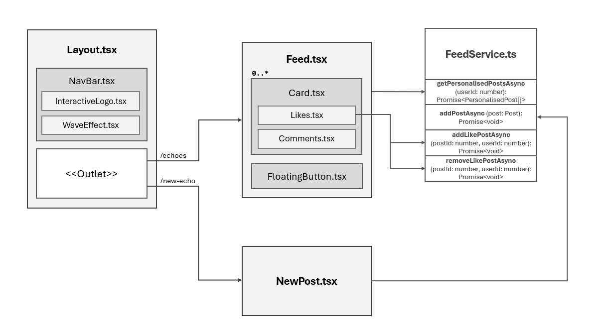

# Social Cards

A kata for building a social card UI component in React. This implementation goes a little deeper and builds out the basic building blocks of a social media web app.



## Installation

*Before getting started, please ensure that you have Node.js version 20 or higher installed on your system.*

Install the project dependencies by running:

```bash
$ npm i
```

## Usage

To run the app locally on your development server, execute the following command:

```bash
$ npm run dev
```

This will start the development server and open the app in your default web browser. Alternatively, you can navigate to http://localhost:5173 in your browser to access the app.

## Testing

To run the test suite, use the following command:

```bash
$ npm t
```

## License

This project is licensed under the MIT License.
